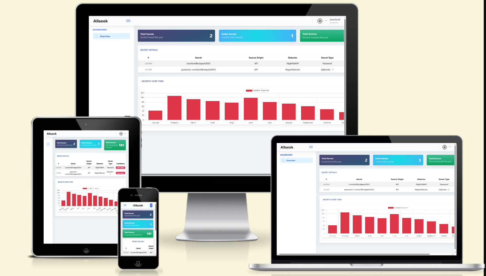

# JunctionX Budapest 2023

## Table of Contents
- Problem statement
- Solution
- Creators

## Problem statement
Everyone agrees that recycling is important. However, there's one area where recycling is dangerous - passwords.
The impact of a breach on governments and utility companies cannot be underestimated. Whereas breaches at corporate enterprises mostly have a financial impact, attacks on important institutions affect millions of people in their daily lives.
For instance, over the past thirty-six months, 87% of utility companies have experienced at least one breach.
Such incidents can lead to social and environmental pressures that could have been avoided.

## Solution
Lateral movement allows attackers to advance within an environment by searching for secrets, such as in local servers, SharePoint, Confluence, and Slack.
Our solution aims to halt the process of these attacks by stopping the possibilities for lateral movement.
We have developed a cybersecurity solution that scans your environment for secrets and passwords. It does this by leveraging advanced security measures.
The dashboard enables IT administrators to maintain oversight.


## Demo



https://dashboard-xzpcu7nwvq-ew.a.run.app/

Sent email to 'allseek_admin@7w1ymt.onmicrosoft.com' for testing credentials detection.

VIDEO: https://www.youtube.com/watch?v=o6Mr95cWBhU

## GCloud Deployment

```gcloud run deploy regex-detector --image=mielverkerken/regex-detector --platform managed --port 8000 --region europe-west1

gcloud run deploy orchestrator --image=mielverkerken/orchestrator --platform managed --set-env-vars NIGHTFALL_API_KEY=NF-QAGiE0LRisoWgvohwQSTN87fM0AHg4WT,NIGHTFALL_DETECTION_RULE_UUID=4eb100fc-71fd-47ff-b10a-21f7bf008f85,REGEX_DETECTOR_URL=https://regex-detector-xzpcu7nwvq-ew.a.run.app,REGEX_DETECTOR_PORT=443 --port 80 --region europe-west1

gcloud run deploy dashboard --image=mielverkerken/dashboard --platform managed --port 80 --region europe-west1

gcloud run deploy integration-teams --image=mielverkerken/integration-teams --platform managed --port 8000 --region europe-west1
```

## Creators
- Miel Verkerken
- Wout Debaenst
- Arne Feys
